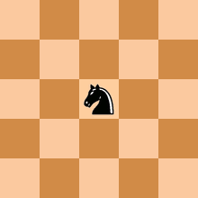
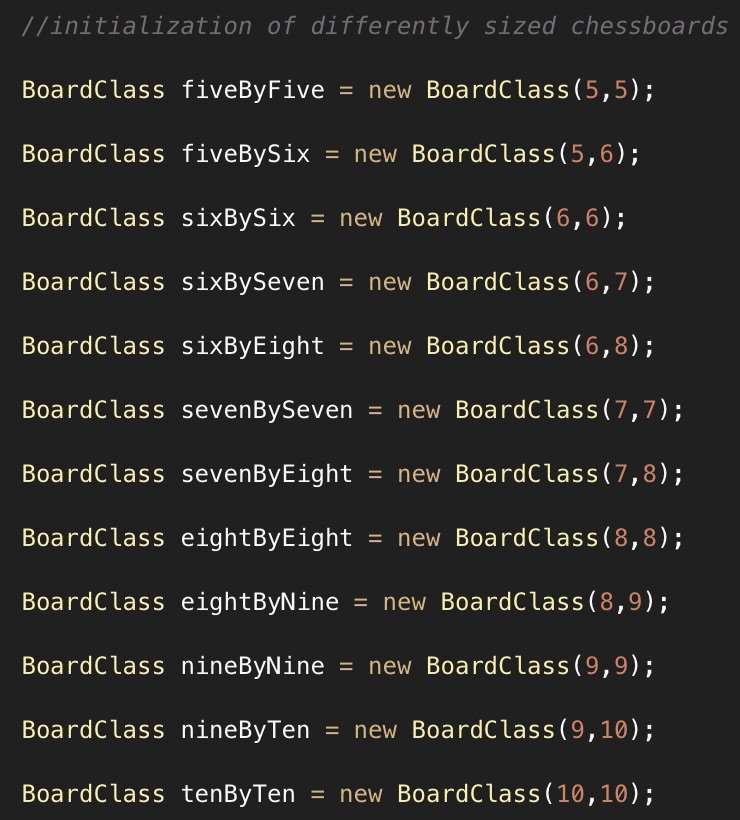

# Nondeterministic Polynomial Time Completeness: A Study of the Knight's Tour Using Heuristic Recursion 

### Arthur Ayestas Hilgert

## Introduction

With the potential introduction of phase-shifting random-access memory and the already accessible resources for large scale parallel processing, computational speed will inevitably become exponentially faster for both institutions and individuals.  This ushers in an unavoidable issue involving cryptography, as developers will inevitably, if not already, run into difficulties keeping their encryption software up to date and secure against decryption capabilities provided by the incredible rate of technological development.  It is in the interest of developers to turn to decision problems, that are incredibly complex to solve, yet that can also be verified in linear time, in the domain of encryption. This described decision problem is classified as NP-Complete. In the interest of determining the eligibility of popular decision problems, this study looks to answer the question: "Is the Knight's Tour NP-Complete?".

## General Theory

The knight's tour is a sequence of moves that visit every real square on a defined chessboard only once, while moving according to the allowable vectors associated with Chess's knight-piece.  On classically constructed chessboards (rectangular chessboards) defined by k x n a knight's tour exists only when k is more than n and n is more than or equal to 5. This definition speaks to the existence of a tour on the chessboard in general.  However, tours may only be observed on spaces of a certain geometric type. For example, on a k x n board where k = n = 5, tours will exist only on squares of a certain colour (alternating squares). 

Computational complexity theory is a domain of computer science tasked with the classification of computational problems, solved by a computer, according to their difficulty. In the classification of decision problem complexity, there exist four distinct complexity groups: P, NP, NP-Hard, and NP-Complete.  The following Euler diagram describes the relationships between these sets of problems.  

A decision problem is in P if the time it takes to find a problem's solution is in polynomial time, and thus, by corollary, its solution can be verified as true in polynomial time. A decision problem is in NP if its solution can be verified as true in polynomial time.  A decision problem is in NP-Hard if it is at least as complex as the hardest decision problem in NP. Problems are NP-Complete, if they satisfy the definition of both NP and NP-Hard problems. 

Warnsdorff's algorithm is a heuristic method specific to the knight's tour.  This heuristic prioritizes moves that land on a square with the least amount of subsequent available moves.  In the graphic below, numbers on squares a valid knight's move away indicate the number of available moves from each square, if the knight were to move to this square.  In this case, the square indicating the value of 2 available subsequent moves would be prioritized.  

## Theoretical Methods

In order to prove that decision problem is in NP-Complete, one must show that its solution validator runs in polynomial time versus the complexity of the specific problem. In the case of the knight's tour, the validating mechanism must function in poly(n) time, where n is the number of spaces (inputs) on the defined chessboard. Additionally, one must prove that the decision problem harder or as hard as all NP problems.  This is a difficult task, thus this must be proved against an already existing NP-complete problem, rather than against all existing NP problems.  

The chosen NP-Complete problem is the traveling salesman.  This problem is in NP-complete, and has a run time in exponential time. Thus, if the knight's tour algorithm also runs in exponential (or plus) time, it is in NP-Hard.

The former proof can be proven by inspection. A validator algorithm, as shown in the isCorrectRun method, that will be discussed in greater detail in the general code anatomy section of this paper, functions by searching the 2-8 valid spaces 
from the final move space of the knight for the next to last move space.  In the matrix below, the validator will start from the spot listed as 24, and search for spaces, a valid knight's move away, holding the 24-1 value.  The validator will go through this n-1 search until n = 0.  Intuitively, this function in linear time, as each space on the chessboard will provide the validator algorithm with a number of searches arbitrarily between 2 and 8.  Thus, the function of validation is in poly(n) time (linear time) where n is the number of board spaces and where poly(n) is approximately 5.5n=t(n). 

The latter proof requires a complex solving algorithm that provides run time values for boards of different sizes, in the interest of graphing the board spaces versus time relationship. 

## General Code Anatomy

The tasks necessary are achieved by the manipulation of three different object classes, all managed by Analysis.java: BoardClass.java, RunData.java, and BoardStatistics.java.  BoardClass is defined by its board dimensions.  When initializing this class, a constructor will define its length and width, where 0 < n = k < ∞ are allowable. The operating class will then have the ability to call the programIterationSpeed method within BoardClass.  This method accepts two i and j coordinates (in integer form)  referring to the knight's initial initial position.  This method calls the programIteration method, finding the solution, or lack thereof, of the specific knight's tour.  The data accumulated from this run, initial points, board size, memory used, run time, and the solution matrix, are then condensed into a RunData object and returned by the programIterationSpeed method to the operating class. 

 

A RunData object stores the previously specified information pertaining to one specific run, as described below.  This class has the ability to return all initialized and calculated values.

The RunData object calculates and returns the run time and memory used of its associated run.  This object also has a boolean return method (isSolved) that will return true, if its initial position has a valid knight's tour. 

The isCorrectRun method will start from the final position of the knight on the solution matrix and iterate back to its initial position, assuring that every position is a knight's move away from the previous one.  This is form of data validation, in addition to inspection. 

The BoardStatistics object is defined by its board size.  This is initialized by a constructor.  BoardStatistics's addRunTotals method accepts RunData objects, from each iteration performed on the BoardClass of the same size, and stores the sum of their run time and memory used data. The data is only accepted if the RunData object houses a valid solution matrix.  If there is no valid knight's tour for its initial point, the BoardStatistics class discards this specific RunData object's data.  

BoardStatistics object calculates the total number of iterations on its board that resulted in a valid solution matrix (rather than a DNE result), and finds their average run time and their average memory used.  This class also calculates the total number of squares on its defined board.  The class has the ability to return all these initialized and calculated values, as well as a boolean from its isBoardValid method, which returns false only if there are no valid knights tours on this board.

Analysis.java initiates 11 BoardClass objects of different dimensions ranging from 5 by 5 to 10 by 10.

This class then initiates 11 BoardStatistics objects of the same dimensions as the BoardClass objects.

The class iterates through every starting position of every board, and accumulates the data within each BoardStatistics object. As seen below, every iteration of "fiveByFive.programIterationSpeed(x,y)" finds the solution of the knight's tour at specific coordinates and returns the run data in form of a RunData object.  Each RunData object is then transferred to the associated BoardStatistics object the addRunTotals method. 

The average memory per iteration, average run time per iteration, and squares per board data points are transferred from every BoardStatistics object to the "data" matrix.  

The data is then printed to the terminal.

## The Knight's Tour Solving Code Model

The problem solving mechanism is housed within BoardClass.java, and used when the previously mentioned programIterationSpeed method is called upon.  The programIteration method is responsible for returning a solved solution matrix describing a valid knights tour from the two starting coordinates provided as parameters.

The eight valid knight's moves are defined outside of any method.

This method will initialize a knightsMoves array, consisting of all -1 values with the initial point then marked as zero, and initialize a move counter. The method then calls the recursionTool method to complete the knights tour. After the tour is completed, the method returns a solution matrix describing a valid knight's tour if there is a solution, if not, it returns a matrix initialized to the value of -1.

The recursionTool method accepts the move counter, the correct point coordinates (x, y), the solution matrix, and the knight's move vectors as parameters. The method uses boolean heuristic recursion to solve the knight's tour. If the move counter as reached the value of the product of the chessboard's length and width, the method returns true and the chain of recursion terminates.  

For each iteration of the recursionTool's use, the warnsdorffAlgorithm and customizedSort methods are called upon to rank the knight's moves' priority in the interest of minimizing the number of decision trees.  Then, the knight's move of first priority is attempted, and the move counter is inputed in place of the -1 at each coordinate landed upon, until the availability method returns false (the move is outside the chessboard, or it is on a value not equal to -1).  Then, the move of next priority, is attempted, and so on.  In the event of no moves being valid, this iteration of the recursionTool method returns false, essentially going back one move, again replacing its coordinate with -1, and terminating its branch of the decision tree.  This process continues until move counter surpasses the maximum amount of moves. At this point, the solution matrix is returned to the programIteration method, as recursionTool finally returns true.  If all branches have been explored and there is no valid solution, the recursionTool method returns false.

The warnsdorffAlgorithm method counts the number of available subsequent moves that every possibly knights move would result in, from the initial position, and stores these values in a matrix.  The customizedSort method ranks each knight's move by lowest to highest available subsequent moves.  Moves that provide subsequent values of 0 or invalid are stored at the end. For example, a set of values {1,3,5,8,0,-1,3,6} for each knights move, would return a matrix of {1,2,7,3,8,4,5,6}.

## Results

The program was run 10 times, but only until the completion of the fourth chessboard's iterations.  Each run took about half a day to complete.  The data printed to the terminal was manually transferred to an excel document.  This data was also transferred to an online data graphing website (because I thought it was more aesthetically pleasing than excel) to create the final time versus board spaces graph.  This graph seen below demonstrates an exponential relationship between time and spaces on the defined chessboard.  

## Discussion

The exponential relationship between time and spaces on the defined chessboard prove that an algorithm for the knight's tour runs in exponential time.  Since, an already defined NP-Hard (and NP-Complete) problem (the travelling salesman problem) also runs in exponential time, the knight's tour is NP-Hard.  As discussed previously, verifier polynomial runtime can be proved by inspection, and by corollary, the knight's tour is in 
NP. These two attributes prove NP-Completeness.  In concurrence with literature provided by McGown and Leininger of Oregon State University and The Massachusetts Institute of Technology, the knight's tour is indeed NP-Complete.  This leads to the conclusion that the knight's tour is an eligible decision problem for modern-day cryptography. 

### References

